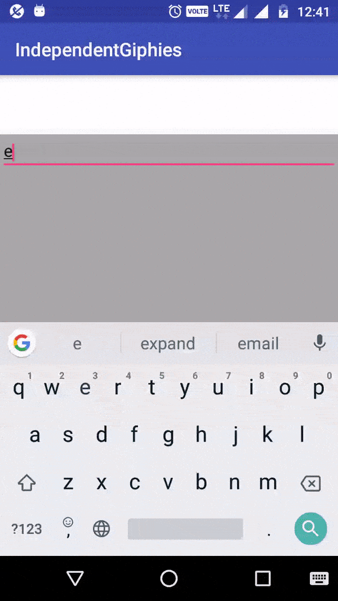

# Gifex

Use library gifex to load and display gifs from different sources.

When included in layout and passed a request, gifex will load gifs from the source (configurable).

Gifex fetches gifs in small chunks.   
Initially, small chunk of gifs are fetched and when user scrolls till end, it fetches the next chunk.  
Limit for a chunk can be configured and total no of gifs can also be configured.

### IMPORTANT
##### Get your own api key from the source(ex : Giphy, Gifskey) 

##### Visit [Giphy](https://developers.giphy.com/) to register an app and get an api key for Giphy
Or                 
##### Visit [Gifskey](http://www.gifskey.com/getAPI/) to get the api key for Gifskey


### Demo


### Code :

in your gradle,   

```
compile 'org.ramanugen.gifex:gifex:1.0.1'
```

Initialize Gifex by

```javascript
Gifex.init(new Gifex.Configuration()
			.httpClient(NetworkHelper.getExternalOkHttpClient())
			.diskCacheLimit(300*1024*1024/*in MBs*/)
			.prefetchImages(true)
			.showSearchBar(true));
```	
Configure Gifex to your needs. 

- httpClient - supply your client that is used for network requests. In the example above, OkHttp client is passed
- diskCacheLimit - the limit on the disk cache used for cacheing the gif files
- prefetchImages - true if gifex has to prefetch the images even before view-image binding happens
- showSearchBar - search bar can be hidden/shown using this config

Include GifGalleryView in your layout like this:

```javascript
<org.ramanugen.gifex.view.GifGalleryView
        android:id="@+id/giphy_space"
        android:layout_width="match_parent"
        android:layout_height="200dp"
        android:layout_alignParentBottom="true"
        android:background="@android:color/darker_gray"
        app:gif_place_holder="@drawable/placeholder_for_gif"/>
```

- Place holder for gif can be configured using custom attribute app:gif_place_holder like shown above.
- Supply a minimum layout_height of 148dp for the neat display of the gifs


Then in onCreate: 
```javascript
giphySpace = (GifGalleryView) findViewById(R.id.giphy_space);
```

#### To search using search bar : 
Initialize the request params in onCreate by :

```javascript
GifRequest request = new GifRequest();
        request.maxLimit = 100; // the total no of gifs allowed to load
        request.eachRequestLimit = 5; // no of gifs to load at a time
        request.source = GifSource.GIPHY; // the source to load gifs from
        request.apiKey = ""; // include API key for the gif source
        
giphySpace.setDefaultRequest(makeGifRequest()); 
```

and when user types some text in the search bar and presses search icon on keyboard, 
the gallery container will be populated with the result gifs for the entered keyword/phrase.

#### To search using pre-decided keyword :
Just pass the keyword as part of the request whenever you want to load gifs 
into the container(Ex: in a button click listener callback) by :

```javascript
GifRequest request = new GifRequest();
        request.maxLimit = 100;
        request.keyword = "Funny"; // keyword to search source for gifs
        request.eachRequestLimit = 5;
        request.source = GifSource.GIFSKEY;
        request.apiKey = ""; // include API key
        
giphySpace.loadInitialData(request,selectionListener);
```

### Licence:
Copyright (c) 2017 - Radhakrishna Bojja

Permission is hereby granted, free of charge, to any person obtaining a copy
of this software and associated documentation files (the "Software"), to deal
in the Software without restriction, including without limitation the rights
to use, copy, modify, merge, publish, distribute, sublicense, and/or sell
copies of the Software, and to permit persons to whom the Software is
furnished to do so, subject to the following conditions:

The above copyright notice and this permission notice shall be included in
all copies or substantial portions of the Software.

THE SOFTWARE IS PROVIDED "AS IS", WITHOUT WARRANTY OF ANY KIND, EXPRESS OR
IMPLIED, INCLUDING BUT NOT LIMITED TO THE WARRANTIES OF MERCHANTABILITY,
FITNESS FOR A PARTICULAR PURPOSE AND NONINFRINGEMENT. IN NO EVENT SHALL THE
AUTHORS OR COPYRIGHT HOLDERS BE LIABLE FOR ANY CLAIM, DAMAGES OR OTHER
LIABILITY, WHETHER IN AN ACTION OF CONTRACT, TORT OR OTHERWISE, ARISING FROM,
OUT OF OR IN CONNECTION WITH THE SOFTWARE OR THE USE OR OTHER DEALINGS IN
THE SOFTWARE.
